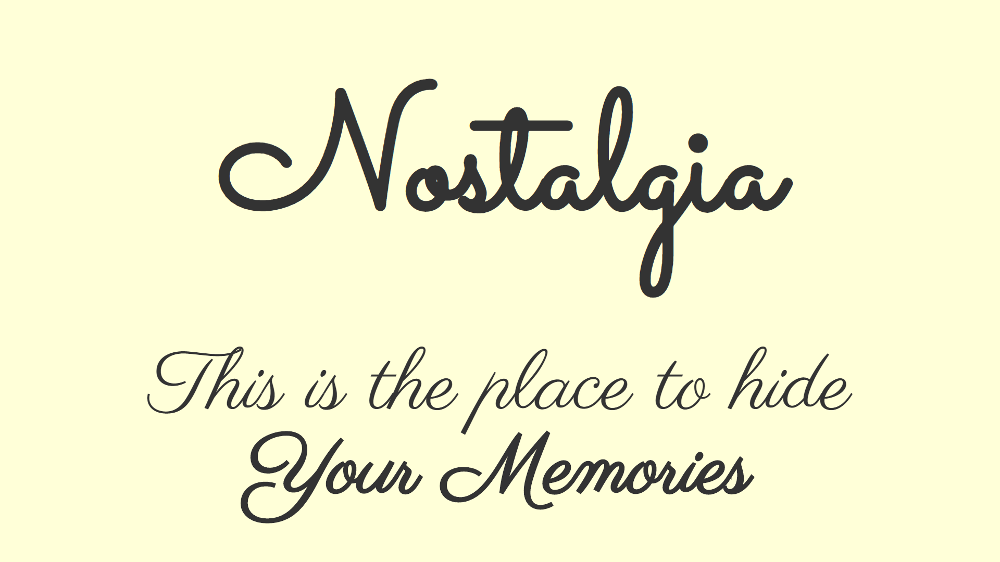

# Nostalgia
Small [Progressive Web App][pwa] to store your notes made in [Svelte][svelte].

## Live
https://konradlinkowski.github.io/Nostalgia

## Installation
```bash
git clone https://github.com/KonradLinkowski/Nostalgia.git
cd Nostalgia
yarn
```

...then start [Rollup](https://rollupjs.org):

```bash
yarn dev
```

Navigate to [localhost:5000](http://localhost:5000). You should see your app running.

## Building and running in production mode

To create an optimised version of the app:

```bash
yarn build
```

[pwa]: (https://web.dev/progressive-web-apps/)
[svelte]: (https://svelte.dev)

## License
This project is [MIT licensed](./LICENSE)
